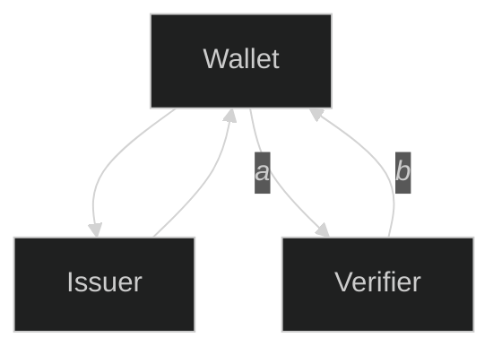
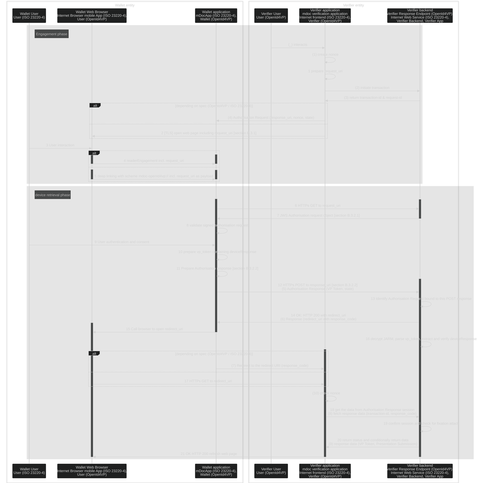

# EUDIW

Web application (Backend Restful service) that would allow somebody to trigger the presentation use case (cross device, remote presentation scenario).

[link to section of the second page](./second.md#section-of-second-page)

## Entity Diagram

In the EUDIW ecosystem there are 3 main entities:
- Wallet,
- Issuer,
- Verifier

This document is focusing on the interactions _a_ and _b_ between Wallet and Verifier.
The Verifier implemented in this repo is part of the Verifier entity, in particular it is the Verifier Backend.

## Sequence diagram for EUDI Wallet entity interaction  

This sequence diagram is a merge of the following specifications:

- [OpenId4VP draft 18, section 10.5, Figure 3](https://openid.net/specs/openid-4-verifiable-presentations-1_0.html)
- ISO 23220-4, Appendix B
- [OAuth 2.0](https://www.rfc-editor.org/rfc/rfc9101.html)

Sequence numbering following format:
- "([0-9])" is from OpenId4VP specifications document,
- "[0-9]" is from ISO 23220-4 specifications document

Useful references are:
- [Presentation exchange](https://identity.foundation/presentation-exchange/spec/v2.0.0/)

(1) The Verifier selects a nonce value as fresh, cryptographically random number with sufficient entropy and associates it with the session.

(2) The Verifier initiates a new transaction at its Response Endpoint.

(3) The Response Endpoint will set up the transaction and respond with two fresh, cryptographically random numbers with sufficient entropy designated as transaction-id and request-id. Those values are used in the process to identify the authorization response (request-id) and to ensure only the Verifier can obtain the Authorization Response data (transaction-id).

(4) The Verifier then sends the Authorization Request with the request-id as state and the nonce value created in step (1) to the Wallet.

(5) After authenticating the End-User and getting her consent to share the request Credentials, the Wallet sends the Authorization Response with the parameters vp_token, presentation_submission and state to the response_uri of the Verifier.

(6) The Verifier's Response Endpoint checks whether the state value is a valid request-id. If so, it stores the Authorization Response data linked to the respective transaction-id. It then creates a response_code as fresh, cryptographically random number with sufficient entropy that it also links with the respective Authorization Response data. It then returns the redirect_uri, which includes the response_code to the Wallet.

Note: If the Verifier's Response Endpoint does not return a redirect_uri, processing at the Wallet stops at that step. The Verifier is supposed to fetch the Authorization Response without waiting for a redirect (see step 8).

(7) The Wallet sends the user agent to the Verifier (redirect_uri). The Verifier receives the Request and extracts the response_code parameter.

(8) The Verifier sends the response_code and the transaction-id from its session to the Response Endpoint.

The Response Endpoint uses the transaction-id to look the matching Authorization Response data up, which implicitly validates the transaction-id associated with the Verifier's session.
If an Authorization Response is found, the Response Endpoint checks whether the response_code was associated with this Authorization Response in step (6).
Note: If the Verifier's Response Endpoint did not return a redirect_uri in step (6), the Verifier will periodically query the Response Endpoint with the transaction-id to obtain the Authorization Response once it becomes available.

(9) The Response Endpoint returns the VP Token and Presentation Submission for further processing to the Verifier.

(10) The Verifier checks whether the nonce received in the Credential(s) in the VP Token in step (9) corresponds to the nonce value from the session. The Verifier then consumes the VP Token and invalidates the transaction-id, request-id and nonce in the session.
